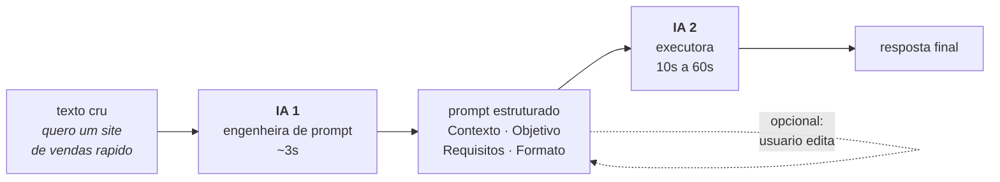

# Pipeline de IA dupla

**Uma IA reescreve o seu pedido. Outra executa.** O usuario escreve *"quero um site de vendas rapido"* e recebe um plano tecnico completo — porque entre ele e o modelo final existe uma camada que transforma o pedido vago em um prompt estruturado.

Node.js + Express + Google Gemini &nbsp;·&nbsp; interface web incluida &nbsp;·&nbsp; [MIT](LICENSE)

---

## O problema

Modelos de linguagem respondem bem a prompts bons. Usuarios leigos escrevem pedidos vagos. A distancia entre as duas coisas costuma ser resolvida pedindo que a pessoa "escreva melhor" — o que nao acontece.

Aqui essa traducao e feita por uma primeira IA, especializada em reescrever, antes de a segunda tentar responder.



A saida traz **as duas pontas**: a resposta final e o prompt intermediario. O prompt fica visivel para auditoria — e editavel, se o usuario quiser corrigir a interpretacao antes de gastar a segunda chamada.

---

## Decisoes de engenharia

O que diferencia isto de um wrapper de duas chamadas de API:

### A saida da IA 1 e forcada por schema, nao por instrucao

Pedir "retorne exclusivamente o prompt" e depois limpar saudacoes com regex e fragil. A chamada usa `responseMimeType: "application/json"` + `responseJsonSchema` com um unico campo: **o modelo nao consegue emitir preambulo**. A restricao vive no decoder, nao na boa vontade dele. Ha fallback para o texto cru se o parse falhar.

### Blindagem contra injecao de prompt

O texto do usuario e conteudo de terceiros. Ele chega envelopado em `<texto_do_usuario>` e a system instruction declara aquele bloco como **dado, nao instrucao** — inclusive quando contem frases como *"ignore as instrucoes acima"*. A regra impede que o usuario sequestre a camada de reescrita.

### Retry com backoff, porque a API falha de verdade

A API do Gemini responde `503 "high demand"` com frequencia em uso normal, e o SDK `@google/genai` nao tem retry proprio. Ambas as camadas repetem em 500/502/503/504 com backoff exponencial + jitter.

**429 fica de fora de proposito:** na pratica significa cota esgotada, e insistir so queima mais cota.

### Bloqueio verificado nos dois pontos

O Gemini barra conteudo na entrada (`promptFeedback.blockReason`) **e** durante a geracao (`candidates[0].finishReason`) — ambos com HTTP 200. Verificar so um deles produz resposta vazia silenciosa.

### Comparacao de senha em tempo constante

`===` em string vaza o tamanho do prefixo correto pelo tempo de resposta, o que permite descobrir a senha caractere a caractere. A verificacao usa `timingSafeEqual` sobre o hash das duas pontas — o hash iguala os comprimentos, porque `timingSafeEqual` lanca excecao com buffers diferentes, e o proprio lancamento seria um sinal.

### A interface mostra o que o servidor sabe

O pipeline leva de 10s a alguns minutos. Em vez de um spinner generico, um stream SSE emite eventos de etapa, de nova tentativa e de texto parcial. A pagina exibe o prompt da IA 1 assim que fica pronto (~5s) e, quando o Gemini falha, **explica o motivo da demora** em vez de deixar o usuario no escuro.

---

## O que a medicao mostrou

Numeros colhidos em uma instancia real do projeto, em plano gratuito de uma
plataforma de container — e que contrariaram hipoteses do proprio autor pelo
caminho:

| Achado | Numero |
|---|---|
| Latencia da IA 2, mesma entrada, execucoes diferentes | 9s a 202s |
| Causa da cauda longa | 503 do Gemini, **cada um levando ~60s para falhar** |
| Custo do backoff programado | 862ms — irrelevante perto do tempo de espera pela falha |
| Tempo raciocinando vs. escrevendo (resposta curta) | 46,4s pensando, 0,1s escrevendo |
| Efeito de trocar o modelo da IA 2 | melhorou o melhor caso, piorou o pior — **sem ganho liquido** |

Duas conclusoes que so apareceram porque os logs foram lidos em vez de presumidos:

1. **A latencia nao vem da escolha de modelo.** A IA 1 usa o mesmo modelo, no mesmo processo e na mesma requisicao, e fica estavel em ~3s. A alavanca real e o nivel de raciocinio (`EXECUTOR_THINKING`), nao o modelo.
2. **Disponibilidade de modelo medida em sondagem e um retrato do momento, nao uma propriedade estavel.** Um benchmark local favoreceu um modelo 3/3 contra 4/9; horas depois, em producao, o ranking se inverteu.

O catalogo do Gemini tambem gira mais rapido que a documentacao: o `codegen_instructions.md` oficial do SDK ainda recomendava um modelo ja aposentado (404) e outro sem cota no tier gratuito (429). **Sondar `ai.models.list()` antes de fixar qualquer modelo** virou parte do processo.

---

## Estrutura

```
src/
  index.js                    bootstrap + shutdown limpo (SIGTERM)
  app.js                      montagem do Express
  config.js                   env validado no boot, com falha cedo
  errors.js                   AppError / ValidationError / PipelineError
  gemini/client.js            cliente unico do SDK @google/genai
  prompts/optimizer.js        system instruction da IA 1 + schema de saida
  prompts/executor.js         system instruction da IA 2
  services/pipeline.js        optimizePrompt / executeTask / runPipeline
  middleware/auth.js          senha compartilhada em tempo constante
  middleware/errorHandler.js  erros do SDK traduzidos para HTTP
  routes/                     processar, otimizar, executar, health, indice
public/index.html             interface web, sem build e sem dependencias
```

Sem framework de front, sem etapa de build: um arquivo HTML servido pelo proprio Express.

---

## API

| Rota | O que faz |
|---|---|
| `POST /processar` | pipeline completo, resposta unica |
| `POST /processar/stream` | o mesmo, em SSE com progresso ao vivo |
| `POST /otimizar` | so a IA 1 — devolve o prompt para revisao |
| `POST /executar/stream` | so a IA 2, a partir de um prompt (editado ou nao) |
| `GET /` | interface web |
| `GET /api` | indice legivel por maquina |
| `GET /health` | liveness probe, nao consome a API do Gemini |

```bash
curl -X POST http://localhost:3000/processar \
  -H 'Content-Type: application/json' \
  -H 'x-senha: SUA_SENHA' \
  -d '{"texto":"quero um site de vendas rapido"}'
```

```json
{
  "prompt_otimizado": "Contexto: ...\nObjetivo: ...\nRequisitos: ...\nFormato de Saida: ...",
  "resposta_final": "...",
  "meta": {
    "otimizacao": { "model": "...", "usage": {}, "latency_ms": 0 },
    "execucao":   { "model": "...", "usage": {}, "latency_ms": 0 },
    "latency_ms_total": 0
  }
}
```

### Eventos do stream

| `tipo` | Quando | Carrega |
|---|---|---|
| `etapa` | inicio/fim de cada camada | no fim da `otimizacao`, ja vem o `prompt_otimizado` |
| `delta` | pedaco de texto da IA 2 | `texto` — concatene na ordem |
| `retry` | um 503 disparou nova tentativa | `status`, `tentativa`, `total`, `espera_ms` |
| `fim` | concluido | o mesmo corpo de `POST /processar` |
| `erro` | falhou depois do stream aberto | `codigo`, `mensagem`, `etapa` |

> **`delta` e retry:** uma nova tentativa recomeca a geracao do zero. Ao receber um `retry` da etapa `execucao`, descarte o texto acumulado — senao a resposta sai duplicada.

### Erros

Formato unico: `{ "erro": { "codigo", "mensagem", "etapa", "detalhes" } }`

| Codigo | HTTP | Quando |
|---|---|---|
| `validation_error` | 400 | campo ausente, vazio ou acima do limite |
| `invalid_json` | 400 | corpo nao e JSON valido |
| `nao_autorizado` | 401 | senha ausente ou incorreta |
| `prompt_blocked` / `content_blocked` | 422 | filtros do Gemini, na entrada ou na geracao |
| `upstream_rate_limited` | 429 | cota esgotada |
| `upstream_auth_error` | 500 | chave invalida (chega como 400 `API_KEY_INVALID`) |
| `max_tokens_truncated` | 502 | resposta cortada no limite de saida |
| `upstream_unavailable` | 503 | 5xx apos esgotar as tentativas |
| `upstream_timeout` | 504 | estourou `REQUEST_TIMEOUT_MS` |

---

## Rodando localmente

Requer Node 20+.

```bash
git clone <url-do-repositorio>
cd pipeline-ia-dupla
npm install
cp .env.example .env    # preencha GEMINI_API_KEY
npm start
```

Chave em [Google AI Studio](https://aistudio.google.com/apikey). `npm run dev` sobe com `--watch`.

### Configuracao

| Variavel | Padrao | Observacao |
|---|---|---|
| `GEMINI_API_KEY` | — | obrigatoria; o processo nao sobe sem ela |
| `ACESSO_SENHA` | vazio | **vazio deixa `/processar` aberto**, com aviso no boot |
| `OPTIMIZER_MODEL` / `EXECUTOR_MODEL` | `gemini-3.1-flash-lite` | sonde `ai.models.list()` antes de fixar outro |
| `OPTIMIZER_THINKING` / `EXECUTOR_THINKING` | `low` / `high` | nivel (Gemini 3) ou orcamento em tokens (Gemini 2.5) |
| `*_MAX_OUTPUT_TOKENS` | 8192 / 32768 | tokens de raciocinio contam nesse limite |
| `RETRY_ATTEMPTS` / `RETRY_BASE_DELAY_MS` | 3 / 1000 | pior caso ≈ tentativas × timeout |
| `REQUEST_TIMEOUT_MS` | 300000 | por tentativa |

O controle de raciocinio mudou entre geracoes do Gemini, e `config.js` aceita as duas formas na mesma variavel:

| Geracao | Campo da API | Valor aceito |
|---|---|---|
| Gemini 3 | `thinkingConfig.thinkingLevel` | `minimal`, `low`, `medium`, `high` |
| Gemini 2.5 | `thinkingConfig.thinkingBudget` | inteiro de tokens (`0` desliga, `-1` automatico) |

> **Armadilha:** tokens de raciocinio contam dentro de `maxOutputTokens`. Teto baixo com raciocinio alto retorna `finishReason: MAX_TOKENS` com texto vazio.

---

## Deploy

O `Dockerfile` serve qualquer plataforma de container. Plataformas que leem
repositorios Node tambem sobem o projeto direto, com `npm install` + `npm start`;
em qualquer caso, injete as variaveis de ambiente pela plataforma e **nunca
comite o `.env`**.

```bash
docker build -t pipeline-ia-dupla .
docker run --rm -p 3000:3000 -e GEMINI_API_KEY=... pipeline-ia-dupla
```

Nao fixe `PORT`: a plataforma costuma injetar a dela, e o `config.js` a le de
`process.env`. Fixar a porta faz o servico subir sem receber trafego — falha
silenciosa, porque o processo sobe normalmente.

> Planos gratuitos costumam hibernar apos inatividade, somando dezenas de
> segundos a primeira chamada. `GET /health` acorda o servico sem consumir a API
> do Gemini.

---

## Licenca

[MIT](LICENSE)
